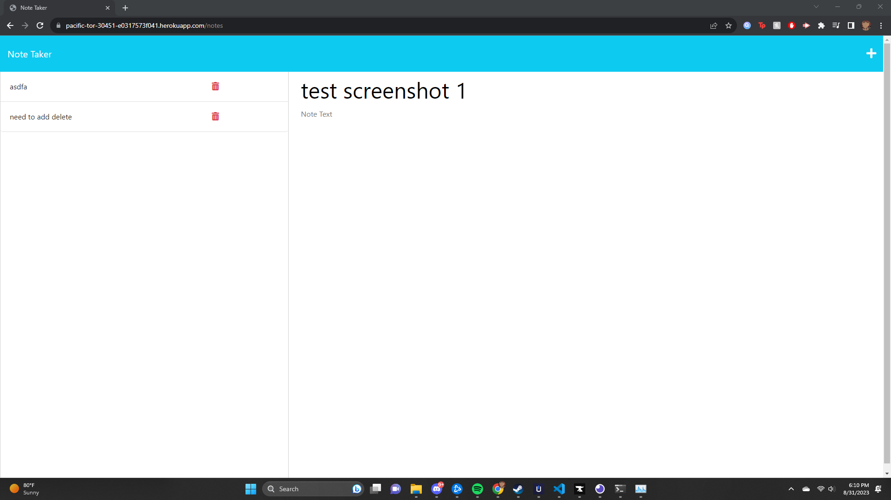
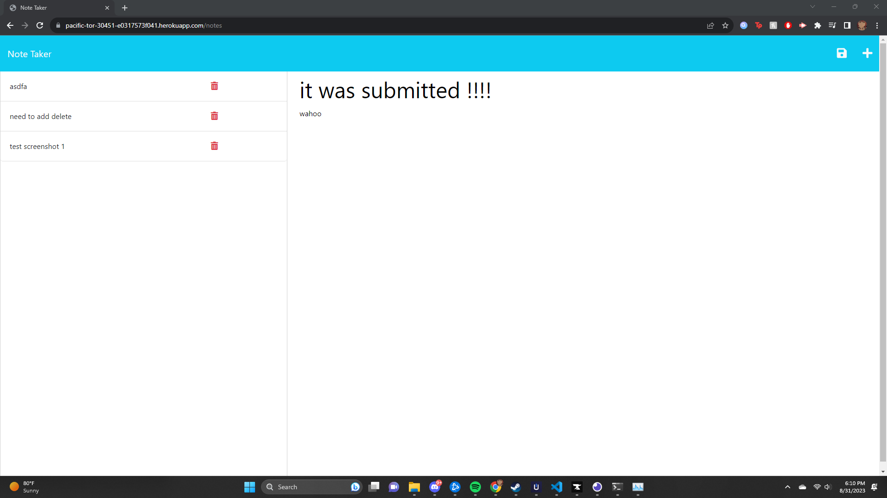

# Express Note Taker

## Description
This is an application that can write notes and (supposed to) delete them.

Express is something that I apparently struggle a lot with, I ended up just writing functions instead of trying to use express to do everything.

Potentially low commits because I was accidently using a git bash connected to the wrong directory...

Overall struggled with this project a ton, definitely not looking forward to any more express.

I had to start over 3x on this project so I definitely struggled a lot with cleanliness in my code with Express. I feel like it is super easy to get lost in the sauce when you're importing files. Also I changed my db to notes.json because db/db.json was very confusing to look at.

## Thanks

Thank you to Tom Hearne and Matthew Bronstein for teaching the class. Thank you to the new Xpert Learning Assistant for doing a lot of the heavy lifting and helping me figure out how to do this project (would of not beenable to do without it). Thank you to Andrew Mell for helping me realize that doing functions is going to be a way more practical way for me to do this project.

## Screenshots

## Deployment
heroku: https://pacific-tor-30451-e0317573f041.herokuapp.com/notes

github: https://alexblaylock.github.io/note-taker-chally11/

repo: https://github.com/AlexBlaylock?tab=repositories